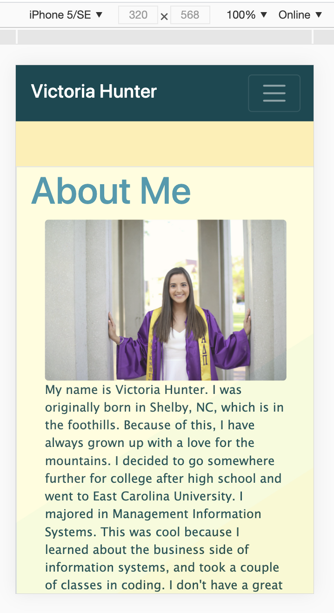
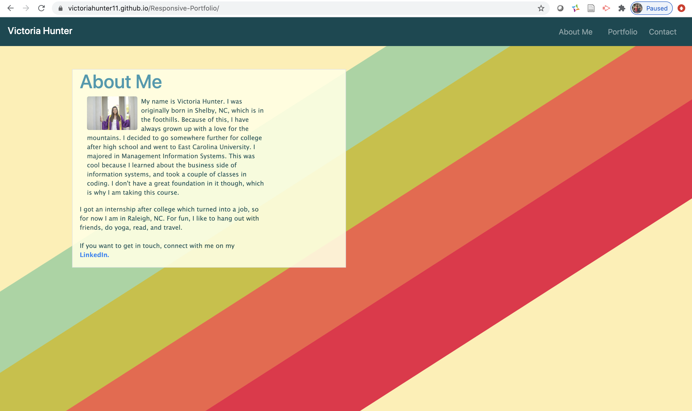

Here is my responsive portfolio. In this assignment, I worked on writing semantic HTML while incorporating bootstrap into my code. I was able to use the bootstrap features like the grid and navbar to achieve my goals for my portfolio. This is a responsive website; therefore, it will adapt to various browsers and their sizes of screens. 

Here is a link to my website:
https://victoriahunter11.github.io/Responsive-Portfolio/

Here are a couple different views of the about me page I did, the first is what it would look like on an iPhone, and the second is the full screen of my macbook:

